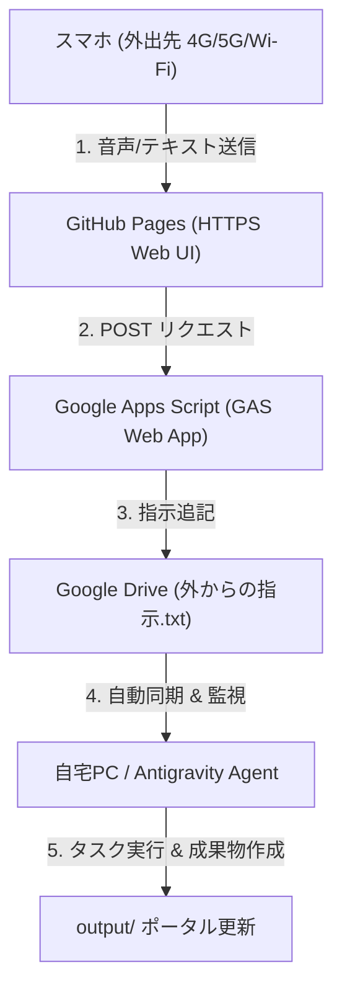

# Antigravity 外出先指示システム (GitHub + GAS + Google Drive + Gemini)

## 📌 システム全体構成

---

## 🚀 設定手順 (5分で完了)

### ステップ 1: Google Apps Script (GAS) のデプロイ
1. ブラウザで [script.google.com](https://script.google.com/) を開きます。
2. 「新しいプロジェクト」を作成します。
3. `gas/Code.gs` 内のコードを全選択してコピーし、GASのエディタに貼り付けて保存します。
4. 画面右上の **「デプロイ」** ➔ **「新しいデプロイ」** をクリックします。
5. 種類に **「ウェブアプリ」** を選択し、以下の設定にします：
   - **実行するユーザー**: 「自分」
   - **アクセスできるユーザー**: 「全員」 (Anyone)
6. **「デプロイ」** ボタンを押し、表示される **「ウェブアプリ URL」** (例: `https://script.google.com/macros/s/AKfycb.../exec`) をコピーします。

---

### ステップ 2: GitHub Pages の公開
1. GitHub にリポジトリを作成（例: `antigravity-remote`）します。
2. `github_pages/index.html` をリポジトリの直下（または `docs/` フォルダ）にコミット・プッシュします。
3. リポジトリの **Settings** ➔ **Pages** を開きます。
4. Source を `main` ブランチに設定して **Save** を押します。
5. 数秒後に完全無料の HTTPS URL（例: `https://<your-username>.github.io/antigravity-remote/`）が発行されます。

---

### ステップ 3: スマホから使用開始！
1. スマホで発行された GitHub Pages URL を開きます。（HTTPS通信のため、ブラウザのマイク権限・音声入力が100%完璧に動作します！）
2. 画面上の入力欄に、ステップ1でコピーした **GAS のウェブアプリ URL** を一度だけ貼り付けて保存します。
3. 画面内のマイクボタン 🎤 またはテキストを入力して **「Google Drive へ指示送信 🚀」** を押します。
4. **Google Drive 内の `外からの指示.txt` へ自動追記** され、PC 側の Antigravity が即座にタスクを実行します！
